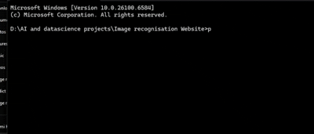

# **🤖 AI Image Recognition Web App**

Welcome to the AI Image Recognition Web App\! This is a full-stack application that uses a custom-trained Convolutional Neural Network (CNN) to classify images in real-time. A user can simply upload an image, and the AI will predict what object is in the picture from 10 different categories.

This project was built from the ground up as a learning journey into the world of deep learning and web deployment.

---

## **✨ Features**

* **Interactive UI:** A clean, modern, and responsive web interface with a drag-and-drop file uploader.  
* **Real-time Prediction:** Uses a custom TensorFlow/Keras model to provide instant image classification.  
* **Detailed Results:** Displays the top prediction with its confidence score, as well as the top 3 most likely categories.  
* **Full-Stack Architecture:** Built with a Flask backend to serve the model and a vanilla JavaScript frontend to handle user interaction.

---

## **🛠️ Tech Stack**

* **Backend:** Python, Flask  
* **AI Model:** TensorFlow, Keras, NumPy  
* **Frontend:** HTML5, CSS3, JavaScript (ES6)  
* **Dataset:** CIFAR-10

---

## **📂 Project Structure**

The repository is organized as follows:

├── app.py                   \# The Flask web server  
├── main.py                  \# The script to train our AI model  
├── predict.py               \# (Optional) Script for command-line predictions  
├── my\_image\_classifier.h5   \# The saved, trained AI model (generated by main.py)  
├── requirements.txt         \# A list of necessary Python packages  
├── templates/  
│   └── index.html           \# The front-end HTML structure  
└── static/  
    ├── style.css            \# The styling for our web page  
    └── script.js            \# The JavaScript for interactivity

---

## **🚀 Setup and Installation**

Follow these steps to get the project running on your local machine.

### **1\. Prerequisites**

* Python 3.8 or higher  
* pip (Python package installer)

### **2\. Create a requirements.txt file**

Create a file named requirements.txt in the main project folder and paste the following lines into it:

tensorflow  
flask  
numpy  
pillow  
flask-cors

### **3\. Installation Steps**

1. **Clone the repository:**  
   Bash  
   git clone https://github.com/your-username/your-repo-name.git  
   cd your-repo-name

2. **Create and activate a virtual environment:**  
   * **Windows:**  
     Bash  
     python \-m venv .venv  
     .\\.venv\\Scripts\\activate

   * **macOS / Linux:**  
     Bash  
     python3 \-m venv .venv  
     source .venv/bin/activate

3. **Install the required packages:**  
   Bash  
   pip install \-r requirements.txt

### **4\. Train the AI Model**

Before you can run the web app, you need to train the model. This script will run for a while and create the my\_image\_classifier.h5 file.

Bash

python main.py

### **5\. Run the Web Server**

Once the model is trained and saved, you can start the Flask web server.

Bash

python app.py

You will see output indicating that the server is running, usually on http://127.0.0.1:5000.

---

## **🖥️ How to Use**

1. After running app.py, open your web browser.  
2. Navigate to **http://127.0.0.1:5000**.  
3. Drag and drop an image file into the upload area, or click "browse" to select one.  
4. Click the "Analyze Image" button.  
5. View the prediction results\!

---

## **🧠 How It Works**

The application consists of two main parts: the AI model and the full-stack web interface.

1. **The AI Model (main.py):** A Convolutional Neural Network (CNN) is built using TensorFlow/Keras. It's designed with data augmentation layers to prevent overfitting, three blocks of Conv2D and MaxPooling2D layers to learn visual features, and a "classifier head" of Dense layers to make the final prediction.  
2. **The Web App (app.py \+ Frontend):** The Flask backend loads the pre-trained my\_image\_classifier.h5 model. The JavaScript frontend sends the user's uploaded image to the /predict API endpoint on the server. The Flask server then preprocesses the image (resizes to 32x32, normalizes pixels) and feeds it to the model. The model's prediction is formatted as JSON and sent back to the frontend, which then dynamically updates the page to display the results.

## **Here is the demo of My Project.**

This project was built from the ground up as a learning journey into the world of deep learning and web deployment.  
👉 You can read the full journey in my Medium article: [How I Built My First Image Recognition Model](https://medium.com/@jasrotia.yadunandan.singh584/how-can-you-build-your-own-image-recognition-model-as-your-first-ai-project-090a20c3ec3e).
